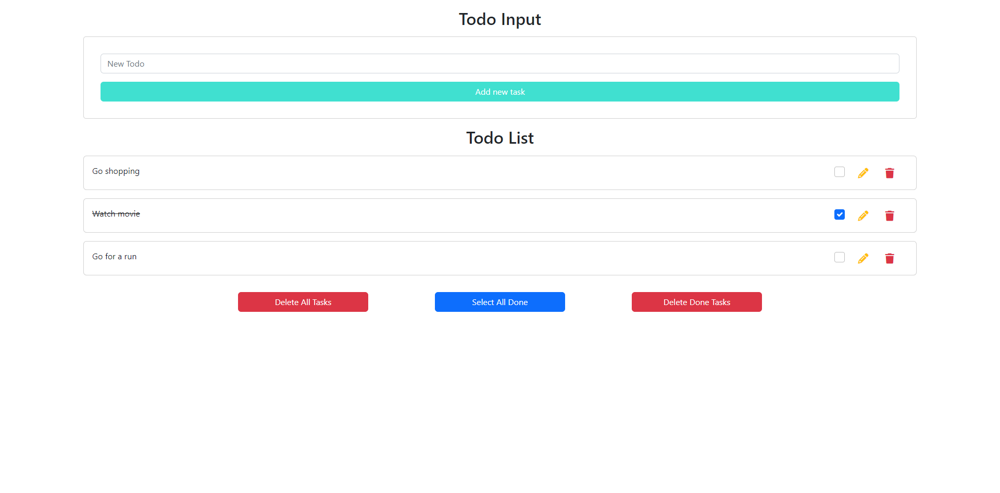
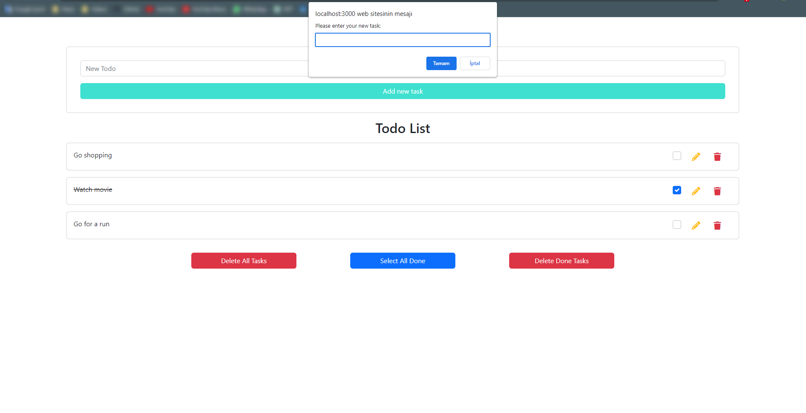

# TodoList

In this project, a TodoList application has been developed to allow users to manage their to-do lists. Users can create tasks, edit them, mark them as completed, or delete them.

  

## Features

- Creating, editing, completing, and deleting tasks
- Clearing the entire list
- Marking the entire list as completed
- Deleting completed tasks

## Getting Started

You can follow the steps below to run the project on your local environment.

1. Clone this repository to your own GitHub account (`git clone https://github.com/your-username/TodoList.git`) or download it as a ZIP file.
2. Install the JDK ,Node.js and MySQL
3. Open the project in IntelliJ IDEA
4. Build and Run the project
5. The backend of the project will be running on localhost:2222.
6. For the frontend of the project there are 2 ways:

- First way:
  - Open the "frontend" folder in VSCode
  - Install the necessary dependencies by running the following command: `npm install`
  - Start the application by running the following command: `npm start`
  - Open your browser and go to `http://localhost:3000`.
- Second way:
  - Navigate to the project directory on terminal in IntelliJIDEA: `cd frontend`
  - Install the necessary dependencies by running the following command: `npm install`
  - Start the application by running the following command: `npm start`
  - Open your browser and go to `http://localhost:3000`.

## Usage

Once you have successfully accessed the application, any existing tasks will be listed on the main page. You can create a new task or edit an existing task using the respective buttons. Additionally, you can mark tasks as completed or delete them.

## License

This project is licensed under the [MIT License](LICENSE).
